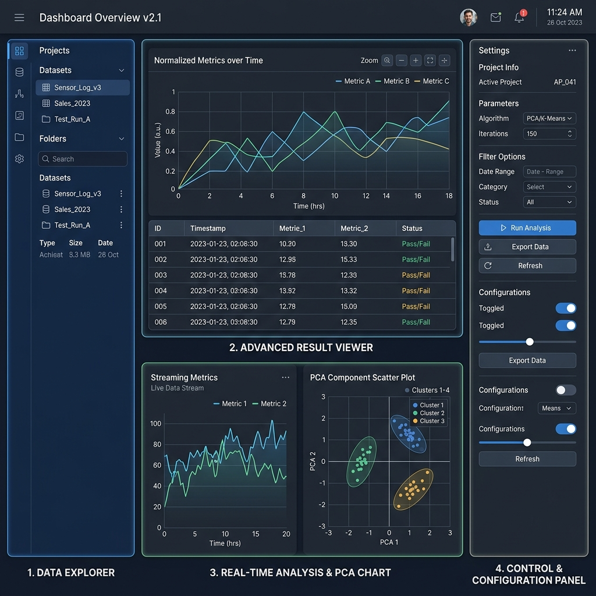

# AMEVA Hybrid STT: High-Fidelity Speech Transcription and Diarization Pipeline

## 핵심 기능 (Core Features)

*   **Hybrid Engine Synergy**: Whisper.cpp의 정밀한 전사 성능과 Vosk의 고속 화자 임베딩 기술을 결합하였습니다.
*   **Sequential Forced Diarization**: 시간축 기반의 확률적 매핑이 아닌, 전사 세그먼트 기준의 강제 매핑으로 화자 분류 오류를 원천 차단합니다.
*   **Interactive Analysis Dashboard**: PCA 기반의 화자 군집 시각화 차트와 실시간 로그 스트리밍을 제공합니다.
*   **Enterprise Batch Processing**: 수백 개의 오디오 파일을 자동으로 스캔하여 처리하며, 모든 이력을 데이터베이스화합니다.
*   **Autonomous Agentic Workflow**: 단순 자동화를 넘어 태스크별 결과물 캡슐화 및 마스터 인덱스 생성을 통해 음성 데이터를 즉시 지식 자산화하는 자율적 에이전트 경험을 제공합니다.

---

## 1. 개요 (Abstract)

본 프로젝트는 하이브리드 음성 인식(STT) 및 화자 분리(Diarization) 기술을 통합하여, 복잡한 다중 화자 대화를 정밀한 정형 데이터로 전환하는 **지능형 음성 처리 에이전트**입니다. 

기존 시스템의 한계인 화자 매핑 오차를 해결하기 위해 **"Sequential Forced Diarization"** 아키텍처를 구현하였으며, 단순한 텍스트 변환을 넘어 **태스크 기반의 데이터 캡슐화**와 **중앙 집중식 메타데이터 관리**를 통해 대규모 음성 자산을 체계적으로 자산화할 수 있는 엔터프라이즈급 워크플로우를 보장합니다. 전용 GUI 대시보드를 통해 모델 파라미터 튜닝부터 실시간 분석 모니터링까지 통합된 제어 환경을 제공합니다.

---

## 2. 시스템 아키텍처 (System Architecture)


본 시스템은 **SSOT(Single Source of Truth) 기반 상태 관리**와 **계층화된 모듈 분리(Layered Architecture)** 원칙을 따르며, 리소스 제약 환경에서도 안정적인 성능을 보장합니다.

### 2.1 처리 파이프라인 (Processing Pipeline)
1.  **Audio Normalization (FFmpeg)**: 다양한 포맷의 입력을 16kHz Mono로 표준화하여 엔진 간 특징 추출의 일관성을 확보합니다.
2.  **Deterministic STT (Whisper)**: 고성능 GGUF 양자화 모델을 통해 텍스트 전사(ASR)를 수행하고 확정된 타임라인을 생성합니다.
3.  **Sequential Forced Embedding (Vosk)**: 확정된 타임라인의 오디오 구간을 개별적으로 재스캔하여 화자 고유의 X-Vector를 추출합니다. (순차 실행으로 OOM 방지)
4.  **Unsupervised Clustering (K-Means/PCA)**: 추출된 화자 지문을 코사인 유사도 기반으로 군집화하고 화자 ID를 결정합니다.
5.  **Task-based Asset Serialization**: 모든 결과물을 태스크 ID 단위로 캡슐화하여 JSON, CSV, TXT 및 클러스터 에셋으로 영구 저장합니다.

### 2.2 GUI 대시보드 구조 (User Interface Design)



에이전트의 모든 제어권은 사용자에게 있으며, 4분할 레이아웃을 통해 작업 흐름의 완결성을 제공합니다.

*   **Integrated Explorer (Left)**: 앱 내부에서 원본 데이터와 분석 결과(JSON, CSV, TXT)를 즉시 브라우징하고 관리할 수 있는 내장 익스플로러를 제공합니다.
*   **Multi-Tab Viewer (Center-Top)**: 배치 작업이 완료된 결과물들을 개별 탭으로 열어 즉각적인 데이터 검토 및 비교 분석이 가능합니다.
*   **Real-time Monitoring (Center-Bottom)**: 시스템의 상태와 파이프라인 진행 상황을 실시간으로 관측하며, 화자 임베딩 데이터를 시각적으로 확인합니다.
*   **Dynamic Control Panel (Right)**: 하이브리드 엔진의 정밀 파라미터 튜닝과 배치 작업 설정을 담당하며, 모든 설정은 실시간으로 저장 및 복원됩니다.

### 2.3 시스템 모니터링 및 로깅 (Monitoring & Logging)

신뢰성 있는 에이전트 운용을 위해 이중화된 로깅 체계와 데이터 시각화 라이브러리를 통합하였습니다.

*   **Dual-Stream Logging**: 시스템 커널 로그와 파이프라인 프로세스 로그를 분리하여, 장시간 배치 작업 시에도 문제 발생 지점을 정확히 추적할 수 있습니다.
*   **Dynamic Speaker Clustering**: PCA(주성분 분석) 알고리즘을 통해 수천 개의 화자 벡터를 2차원 평면에 투영, 화자 분리의 타당성을 시각적으로 검증합니다.
*   **Persistence Sync**: 모든 사용자 조작과 엔진 상태는 `settings.json`과 동기화되어, 예기치 못한 종료 시에도 이전 작업 상태를 완벽하게 보존합니다.

---

## 3. 디렉토리 구조 (Directory Structure)

도메인 주도 설계(DDD) 관점의 모듈화와 배치 단위의 데이터 격리(Isolation) 원칙을 적용하였습니다.

```text
AMEVA-STT-Agent/
├── db/                 # 중앙 메타데이터 저장소 (Batch Log, Mapping CSV)
│   └── clusters/       # 화자 지문 데이터 저장소
│       └── {Batch_ID}/ # 배치 단위로 격리된 화자 벡터(JSON)
├── gui/                # PyQt6 기반 고성능 대시보드 UI
│   ├── panels/         # 개별 UI 컴포넌트 (Explorer, Logging, Settings 등)
├── output_results/     # 최종 분석 결과물 저장소
│   └── {Batch_ID}/     # 태스크 단위로 캡슐화된 결과셋 (JSON, TXT, CSV)
├── src/
│   ├── core/           # 하이브리드 파이프라인 오케스트레이터 및 상태 관리
│   ├── diarization/    # X-Vector 추출 및 클러스터링 알고리즘
│   └── utils/          # 비동기 워커, 모델 다운로더 등 시스템 유틸리티
├── settings.json       # SSOT(Single Source of Truth) 시스템 설정 파일
└── main.py             # 시스템 엔트리 포인트 (환경 설정 및 글로벌 폰트 적용)
```

---

## 4. Docker 컨테이너화 (Docker Containerization)

본 시스템은 GUI 대시보드 환경과 배치(Batch) 워커 환경의 분리를 고려하여 설계되었습니다.
- **Headless Worker**: 대용량 데이터베이스 연동이나 클라우드 스케일아웃이 필요한 경우, `docker-compose.yml`을 통해 Ubuntu 기반의 Headless 워커 노드로 즉각 전환할 수 있습니다.
- **Volume Mounting**: 볼륨 마운트(`C:\ameva:/app/data`)를 통해 컨테이너 내부의 처리 결과는 즉시 Windows 호스트의 GUI 뷰어에서 확인 가능합니다.

---

## 5. 설치 및 실행 (Getting Started)

### 5.1 로컬 실행 (Windows)
1. **가상 환경 구성**:
   ```cmd
   python -m venv .venv
   .venv\Scripts\activate
   pip install -r requirements.txt
   ```
2. **애플리케이션 구동**: 
   ```cmd
   python main.py
   ```
3. **모델 준비**: 앱 실행 후 `SETTINGS` 패널에서 원하는 Whisper 모델(Small, Medium, Turbo 등)을 선택하고 **📥 다운로드** 버튼을 클릭하여 자동 설치합니다.

### 5.2 도커 실행 (Optional)
```cmd
docker-compose -f docker/docker-compose.yml up --build -d
```

---

## 6. 기술적 Deep Dive (Technical Deep Dive)

### 6.1 결정론적 하이브리드 오케스트레이션 (Deterministic Orchestration)
단일 엔진의 한계를 극복하기 위해 Whisper(ASR)와 Vosk(Diarization)를 결합한 하이브리드 아키텍처를 채택하였습니다. 
*   **자원 최적화 전략**: 메모리 점유율이 높은 두 엔진을 동시에 적재하는 대신, 순차적(Sequential) 실행 구조를 설계하여 저사양 환경(RAM 8GB 이하)에서도 시스템 다운(OOM) 없이 안정적인 분석을 보장합니다.
*   **비동기 워커 구조**: 파이썬의 GIL(Global Interpreter Lock) 병목을 회피하기 위해, 무거운 연산은 별도의 백그라운드 스레드에서 `QProcess`를 제어하는 워커 방식으로 구현하였으며, 메인 UI와의 통신은 `PyQt6 Signal` 시스템을 통해 비차단(Non-blocking) 방식으로 이루어집니다.

### 6.2 Windows 커널 및 파일 시스템 최적화
윈도우 특유의 파일 핸들링 메커니즘과 인코딩 정책에 대응하기 위한 전역적 방어 로직을 구현하였습니다.
*   **파일 잠금(File Lock) 대응**: `QFileSystemWatcher`가 신규 디렉토리를 감시하는 시점과 파이프라인이 결과를 쓰는 시점 사이의 경쟁 상태(Race Condition)를 해결하기 위해, 지연된 이벤트 처리와 예외 포착 루틴을 적용하였습니다.
*   **데이터 자산화 인코딩**: 엑셀(Excel) 등 외부 스프레드시트 소프트웨어에서의 데이터 무결성을 위해, 모든 CSV 출력물에 `utf-8-sig` (BOM) 인코딩을 적용하여 별도의 변환 과정 없는 즉각적인 지식 자산화를 실현하였습니다.
*   **경로 견고성(Path Robustness)**: 상대 경로 연산 시 발생할 수 있는 `WinError 3`를 원천 차단하기 위해, 실행 시점의 워킹 디렉토리를 기준으로 전역적인 절대 경로 변환 필터를 거치도록 설계하였습니다.

### 6.3 시계열 정렬 알고리즘: Shortest Distance Mapping (SDM)
서로 다른 타임스탬프 오프셋을 가진 두 엔진의 결과물을 정합하기 위해 자체 개발한 SDM 알고리즘을 적용하였습니다.
*   **정밀한 화자 매핑**: 각 전사 세그먼트의 중앙값(Median Time)을 기준으로, Vosk가 추출한 화자 클러스터 데이터 중 시간상 가장 인접한 화자를 1:1로 강제 매핑(Forced Alignment)합니다.
*   **윈도우 필터링**: `--max_offset` 파라미터를 통해 매핑 허용 범위를 동적으로 조절하며, 음향적 노이즈나 무음 구간에서도 화자 데이터가 섞이지 않도록 논리적 격리를 수행합니다.

### 6.4 태스크 기반 데이터 캡슐화 (Data Encapsulation)
모든 분석 결과물은 생성되는 순간부터 독립적인 '태스크(Task)'라는 논리적 단위로 관리됩니다.
*   **격리 저장(Isolation)**: 배치 ID와 타임스탬프가 결합된 전용 폴더 내에 JSON(Raw), TXT(Human-readable), CSV(Index) 및 클러스터 에셋을 패키징하여 저장함으로써 데이터 오염을 방지하고 이동성을 확보하였습니다.

### 6.5 주요 라이브러리 명세
*   **pywhispercpp**: whisper.cpp의 C++ 바인딩으로 저사양 CPU 가속 지원.
*   **vosk**: Kaldi 기반 오프라인 화자 식별 엔진.
*   **PyQt6**: 네이티브 성능의 고해상도 GUI 프레임워크.
*   **scikit-learn**: K-Means 군집화 및 PCA 연산 담당.

---

## 7. 개발 회고 및 향후 과제 (Reflections & Roadmap)

### 7.1 GUI 개발 및 에이전트 구축 회고
*   **기술의 시각화와 신뢰**: 단순 터미널 로그를 넘어 실시간 차트와 시각화 도구를 통합함으로써, 복잡한 AI 로직을 투명하게 제어할 수 있는 신뢰 환경을 구축하였습니다.
*   **상태 관리와 견고함**: 영속성(Persistence), 워커 생명주기, 파일 시스템 락 대응 등 엔지니어링적 난제들을 해결하며 에이전트 소프트웨어의 완성도를 높였습니다.
*   **자율적 워크플로우**: 단순 자동화를 넘어 사용자의 시간을 벌어주는 '디지털 파트너'로서의 정체성을 확립한 것이 이번 프로젝트의 가장 큰 수확입니다.

### 7.2 향후 로드맵
*   **지능형 자동 요약**: 로컬 LLM(Llama 3 등)을 연동하여 회의록 자동 요약 및 액션 아이템 추출 기능 구현.
*   **실시간 스트리밍**: 라이브 녹음 및 실시간 전사/화자 식별 기능 추가.
*   **화자 식별 정밀도 고도화**: Unknown 비율 최소화를 위한 2단계 클러스터링 및 보간 알고리즘 도입.
*   **자원 최적화 가이드**: 하드웨어 사양에 따른 최적의 스레드 및 모델 크기 자동 추천 시스템.

---

© 2024 AMEVA Project. All rights reserved.
