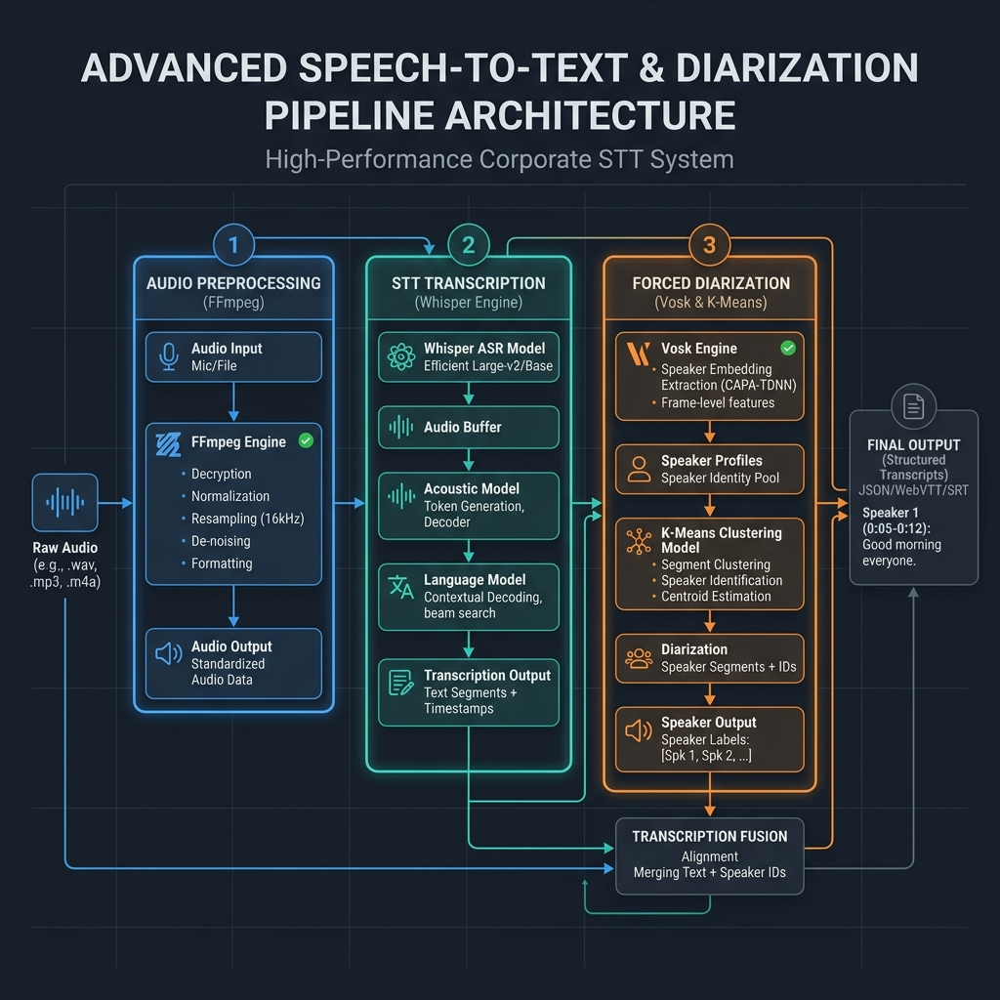

# AMEVA Hybrid STT: High-Fidelity Speech Transcription and Diarization Pipeline

> **[프로젝트 요약 (Resume Profile)]**
> 
> * **① 제목:** Whisper-Vosk 하이브리드 화자 분리 및 전사 엔진 (AMEVA STT Agent)
> * **② 주제:** 
>   * 엣지/모바일 환경에서 외부 클라우드 의존성 없이 로컬 오프라인만으로 고정밀 음성 인식 및 다중 화자 식별 대시보드를 통합 구축 지향
>   * `Streamlit` 프론트엔드, `STTPipeline` 코어 오케스트레이터, `whisper.cpp` 디코딩 프로세스, `Vosk` 임베딩, 그리고 SQLite3 영속성 로거 간의 유기적 협업 구현
>   * 모바일 OS(Termux) 환경 우회, 다중 화자 VAD 분할 딜레이, 그리고 CPU 스레드 과부하로 인한 대시보드 무반응 문제를 방지하기 위한 비동기 제어 구조 구현
> * **③ 내용요지:**
>   * **사용 기술:** `Python 3.12`, `Streamlit`, `vosk` (python-vosk), `pywhispercpp`, `plotly`, `pandas`, `tkinter`, `matplotlib`, `yt_dlp`, `sqlite3`, `wave`
>   * **사용 모델:** `Whisper.cpp (Small, Tiny)` (STT), `Vosk STT Model` (음성 특징 추출), `Vosk Spk Model` (화자 임베딩 추출)
>   * **핵심 알고리즘:** 화자 인격 임베딩 벡터 간의 `cosine_similarity` 산출, 다차원 임베딩 축소를 위한 멱반복법(`Power Iteration`) 기반 2D `PCA` 변환 및 `K-Means Clustering` 화자 군집화, 문맥 분할을 위한 Whisper `VAD` 제어, 타임라인 오차 제한을 위한 `시간차 최소화 정렬 매핑`
>   * **에이전트/보안 제어 (또는 핵심 아키텍처 흐름):** 사용자 오디오 업로드 또는 유튜브 주소 유입 -> subprocess 경유 `whisper.cpp` 구동 및 임계 길이 단위 세그먼트 전사 -> wave 모듈 및 `Vosk` spk_model 결합을 통한 X-Vector 화자 임베딩 생성 -> K-Means Clustering 군집 분석 및 PCA 좌표 사영 -> 임베딩 중심값(Centroid) 도출 -> 시간차 및 코사인 유사도 기준 Whisper-Vosk 인터벌 교차 정렬 -> SQLite3 히스토리/에러 감사 로그 적재 -> Streamlit 대시보드 시각화 및 Word 회의록 출력 흐름
>   * **연구 성과:** `sys.platform = 'linux'` bypass 구조를 이식해 모바일 터미널(Termux)에서도 동일 인퍼런스 파이프라인을 온전히 실현하고, 시간 최소화 정렬 매핑 알고리즘을 도입해 단락별 화자 지정 매칭 신뢰도 대폭 증가
> * **④ 기여도:** 단독 개발 (100% - 아키텍처 설계, 보안 시스템 구축, 코어 로직 구현 전담)

# AMEVA Hybrid STT: High-Fidelity Speech Transcription and Diarization Pipeline

---

---

## 3. 설계 철학 (Core Philosophy)

본 시스템은 보안이 극대화된 비즈니스 환경과 리소스가 제한된 독립 구동 환경을 타겟으로 설계되었으며, 네 가지 핵심 가치를 준수합니다.

1. **로컬라이징 (Localizing)**
   - 모든 AI 모델 파일, 임베딩 백터, 로그 데이터, 그리고 데이터베이스는 로컬 경로(`C:\ameva\`) 내에 엄격하게 내재화되어 저장 및 관리됩니다. 호스트 머신의 시스템 경계를 벗어나지 않는 격리 구조를 가집니다.
2. **오프라인 환경 (Offline-First)**
   - 외부 클라우드 STT API(OpenAI Whisper API, Naver CLOVA Speech 등)에 일절 의존하지 않고, 오직 로컬 CPU 가속 및 로컬 추론 엔진(pywhispercpp & Vosk)만을 활용하여 동작하므로, 네트워크가 차단된 완전 폐쇄망 환경에서도 음성 데이터 유출 우려 없이 안전하게 작동합니다.
3. **기능 우선 중심 (Feature-Centric)**
   - 대규모 일괄 처리(Batch), 실시간 로그 감시, 직관적인 화자 군집 시각화(PCA), 다중 모델 벤치마킹 비교, 자동화된 엔터프라이즈 보고서 생성 등 현업 사용자에게 실제 필요한 핵심 유틸리티 기능을 최우선으로 제공합니다.
4. **안정적인 구동 환경 (Stable Operation)**
   - 시스템 리소스 충돌과 OOM(Out of Memory)을 원천 방어하기 위한 순차 처리 구조를 설계하고, 백그라운드 멀티프로세스의 안정성을 보장하며 예외 로그 수집을 통해 예기치 못한 비정상 작동에 철저히 대비합니다.

---

## 4. 핵심 기능 (Core Features)

*   **Hybrid Engine Synergy**: Whisper.cpp의 정밀한 전사 성능과 Vosk의 고속 화자 임베딩 기술을 결합하였습니다.
*   **Sequential Forced Diarization**: 시간축 기반의 확률적 매핑이 아닌, 전사 세그먼트 기준의 강제 매핑으로 화자 분류 오류를 원천 차단합니다.
*   **Streamlit-based Interactive Analytics**: Plotly 기반의 interactive 화자 군집 시각화 차트와 실시간 로그 스트리밍을 제공합니다.
*   **Multi-Model Benchmarking**: 단일 오디오에 대해 복수의 내장/커스텀 모델을 순차 구동하여 정량적인 정확도 및 속도를 직접 비교할 수 있습니다.
*   **Enterprise Batch & Scheduling**: 입력 폴더의 파일 변화를 감지하는 자동 스케줄러와 배치 처리로 대용량 데이터 자산화를 가속화합니다.
*   **Enterprise Report Autogeneration**: 분석 결과를 바탕으로 도표와 차트 이미지가 포함된 고품질 Word 문서(`docx`) 보고서를 클릭 한 번으로 자동 생성합니다.

---

## 5. 개요 (Abstract)

본 프로젝트는 하이브리드 음성 인식(STT) 및 화자 분리(Diarization) 기술을 통합하여, 복잡한 다중 화자 대화를 정밀한 정형 데이터로 전환하는 **지능형 음성 처리 에이전트**입니다. 

기존 시스템의 한계인 화자 매핑 오차를 해결하기 위해 **"Sequential Forced Diarization"** 아키텍처를 구현하였으며, 단순한 텍스트 변환을 넘어 **태스크 기반의 데이터 캡슐화**와 **중앙 집중식 메타데이터 관리**를 통해 대규모 음성 자산을 체계적으로 자산화할 수 있는 엔터프라이즈급 워크플로우를 보장합니다. **Streamlit 기반의 전용 웹 GUI 대시보드**를 통해 모델 파라미터 튜닝부터 유튜브 다운로드, 다중 모델 비교, 실시간 로그 분석, 데이터베이스 이력 관리까지 통합된 제어 환경을 제공합니다.

---

## 6. 시스템 아키텍처 (System Architecture)



본 시스템은 **SSOT(Single Source of Truth) 기반 상태 관리**와 **계층화된 모듈 분리(Layered Architecture)** 원칙을 따르며, 리소스 제약 환경에서도 안정적인 성능을 보장합니다.

### 2.1 처리 파이프라인 (Processing Pipeline)

1.  **Audio Normalization (FFmpeg)**: 다양한 포맷의 입력을 16kHz Mono로 표준화하여 엔진 간 특징 추출의 일관성을 확보합니다.
2.  **Deterministic STT (Whisper)**: 고성능 GGUF 양자화 모델을 통해 텍스트 전사(ASR)를 수행하고 확정된 타임라인을 생성합니다.
3.  **Sequential Forced Embedding (Vosk)**: 확정된 타임라인의 오디오 구간을 개별적으로 재스캔하여 화자 고유의 X-Vector를 추출합니다. (순차 실행으로 OOM 방지)
4.  **Unsupervised Clustering (K-Means/PCA)**: 추출된 화자 지문을 코사인 유사도 기반으로 군집화하고 화자 ID를 결정합니다.
5.  **Task-based Asset Serialization**: 모든 결과물을 태스크 ID 단위로 캡슐화하여 JSON, CSV, TXT, 클러스터 에셋 및 Word 보고서 파일로 영구 저장합니다.

### 2.2 GUI 프레임워크 전환 (Streamlit UI Transition Rationale)

기존의 PyQt6 데스크톱 애플리케이션 프레임워크에서 **Streamlit 웹 UI 프레임워크**로 성공적인 마이그레이션을 단행했습니다.

####  수정 이유 (Why)

- **PyQt6의 복잡성 제거**: 비동기 백그라운드 연산을 위해 설계된 복잡한 `QThread`, `QProcess`, `PyQt6 Signal` 통신 구조의 유지보수 비용을 절감하고자 했습니다.
- **풍부한 데이터 시각화 라이브러리 연동**: Plotly 및 Pandas 기반의 차트와 테이블을 별도의 윈도우 그리기 로직 없이 직관적이고 미려하게 렌더링## 3. 디렉토리 구조 (Directory Structure)

도메인 주도 설계(DDD) 관점의 모듈화와 배치 단위의 데이터 격리(Isolation) 원칙을 적용하였습니다.

```text
AMEVA-STT-Agent/
├── output_results/           # 최종 분석 결과물 저장소 (설정에 따라 변경 가능)
│   └── {Batch_ID}/           # 태스크 단위로 캡슐화된 결과셋 (JSON, TXT, CSV)
├── src/
│   ├── core/                 # 하이브리드 파이프라인 오케스트레이터 및 설정 관리
│   │   ├── pipeline.py       # Whisper/Vosk 순차 실행 제어 및 프로세스 관리
│   │   └── settings_manager.py  # settings.json SSOT 관리
│   ├── db/                   # 데이터베이스 설계 및 마이그레이션 모듈
│   │   ├── db_manager.py     # SQLite 테이블 생성 및 CRUD 메소드
│   │   └── migrate_csv.py    # 기존 레거시 CSV 로그 -> SQLite 일괄 이관 스크립트
│   ├── diarization/          # X-Vector 추출 및 클러스터링 알고리즘
│   └── utils/                # 보고서 생성 및 기타 시스템 유틸리티
│       └── report_generator.py  # python-docx 기반 Word 비교/단일 리포트 작성기
├── settings.json             # SSOT(Single Source of Truth) 시스템 설정 파일
├── requirements.txt          # 패키지 의존성 파일
├── app.py                    # Streamlit 기반 통합 웹 대시보드 엔트리 포인트
├── cli.py                    # CLI 구동용 실행 파일
├── start_ameva.bat           # Windows용 원클릭 자동 실행 배치 파일
└── start_ameva.ps1           # Windows PowerShell용 자동 실행 스크립트
```

---

## 7. Docker 컨테이너화 (Docker Containerization)

본 시스템은 GUI 대시보드 환경과 배치(Batch) 워커 환경의 분리를 고려하여 설계되었습니다.
- **Headless Worker**: 대용량 데이터베이스 연동이나 클라우드 스케일아웃이 필요한 경우, `docker-compose.yml`을 통해 Ubuntu 기반의 Headless 워커 노드로 즉각 전환할 수 있습니다.
- **Volume Mounting**: 볼륨 마운트(`C:\ameva:/app/data`)를 통해 컨테이너 내부의 처리 결과는 즉시 Windows 호스트의 GUI 뷰어에서 확인 가능합니다.

---

## 8. 설치 및 실행 (Getting Started)

### 5.1 로컬 실행 (Windows)
1. **가상 환경 구성**:
   ```cmd
   python -m venv .venv
   .venv\Scripts\activate
   pip install -r requirements.txt
   ```
2. **애플리케이션 구동**: 
   - 스크립트로 간편하게 구동하려면 프로젝트 루트의 `start_ameva.bat` 또는 `start_ameva.ps1`을 실행합니다.
   - 수동 구동 시:
     ```cmd
     streamlit run app.py
     ```
3. **모델 준비**: 앱 실행 후 사이드바의 **1. 모델 구성** 패널에서 원하는 Whisper 모델(Small, Medium, Turbo 등)을 선택하고 ** 다운로드** 버튼을 클릭하여 로컬 디렉터리에 다운로드 및 연동합니다.
   - Vosk 한국어 화자 분류 모델과 X-Vector 화자 모델은 로컬 지정 경로(`C:\ameva\AI_Models\vosk\ko-model` 및 `C:\ameva\AI_Models\vosk\spk-model`)에 압축 해제하여 배치해야 정상 작동합니다.

### 5.2 도커 실행 (Optional)

```cmd
docker-compose -f docker/docker-compose.yml up --build -d
```

---

## 9. 기술적 Deep Dive (Technical Deep Dive)

### 6.1 결정론적 하이브리드 오케스트레이션 (Deterministic Orchestration)
단일 엔진의 한계를 극복하기 위해 Whisper(ASR)와 Vosk(Diarization)를 결합한 하이브리드 아키텍처를 채택하였습니다. 
*   **자원 최적화 및 OOM 방지 전략**: 메모리 점유율이 높은 Whisper 추론 프로세스와 Vosk 화자 임베딩 추출 프로세스를 동시에 백그라운드에 적재하여 실행하지 않고, **순차적(Sequential) 실행 구조**를 채택했습니다. Whisper를 구동하여 텍스트 전사 및 시간 정보를 확정한 후, 해당 프로세스를 안전하게 셧다운하고 그 뒤에 Vosk를 올림으로써 저사양 환경(RAM 8GB 이하)에서도 시스템 다운(OOM) 없이 일련의 전체 처리를 완수할 수 있는 압도적인 구동 안정성을 획득했습니다.
*   **비동기 워커 및 멀티프로세싱**: 파이썬의 GIL(Global Interpreter Lock)로 인한 메인 대시보드 UI 얼어붙음(Freeze) 병목을 우회하기 위해, 무거운 AI 추론 연산은 `multiprocessing.Process`를 활용해 별도의 독립적인 하위 OS 프로세스로 격리하여 수행합니다. 프로세스 간 데이터 통신은 `multiprocessing.Manager().Queue()`를 이용하며, 진행 로그는 비차단(Non-blocking) 비동기 방식으로 큐를 통해 수집되어 실시간으로 화면에 동적 스트리밍됩니다.

### 6.2 Windows 멀티프로세싱 및 Streamlit 컨텍스트 안정화

*   **Windows Subprocess Spawn 가드**: Windows 운영체제에서는 새 프로세스 시작 시 부모 프로세스의 스크립트를 다시 가져와 임포트(Import)하는 특징이 있습니다. 이 과정에서 Streamlit 위젯 생성이나 렌더링 로직이 전역에 호출되면 `missing ScriptRunContext` 경고가 무수히 발생하거나 무한 스레드 스폰 루프가 발생할 수 있습니다. 이를 방지하기 위해 `app.py` 전체 실행부 구조를 `main()` 함수에 캡슐화하고, `if __name__ == '__main__':` 블록 내에서만 가동되도록 안정화 필터를 구현했습니다.
*   **세션 상태 Widget Lock 해소**: Streamlit에서 위젯에 바인딩된 `key`를 사용자 상호작용 도중 직접 수정(`st.session_state["c_in"] = f` 등)하면 위젯 상태 무결성이 깨지며 `StreamlitAPIException`을 발생시킵니다. 이를 방지하기 위해 파일 브라우저 및 탐색 기능 구현 시 입력 및 바인딩 키의 직접 조작을 지양하고, 위젯의 `value` 변수에 바인딩 상태를 대입한 후 변경 시에만 세션 상태를 수동 동기화하는 패턴을 전방위 도입하여 UI 크래시를 완전히 차단했습니다.

### 6.3 시계열 정렬 알고리즘: Shortest Distance Mapping (SDM)

서로 다른 타임스탬프 오프셋을 가진 두 엔진의 결과물을 정합하기 위해 자체 개발한 SDM 알고리즘을 적용하였습니다.
*   **정밀한 화자 매핑**: 각 전사 세그먼트의 중앙값(Median Time)을 기준으로, Vosk가 추출한 화자 클러스터 데이터 중 시간상 가장 인접한 화자를 1:1로 강제 매핑(Forced Alignment)합니다.
*   **윈도우 필터링**: `--max_offset` 파라미터를 통해 매핑 허용 범위를 동적으로 조절하며, 음향적 노이즈나 무음 구간에서도 화자 데이터가 섞이지 않도록 논리적 격리를 수행합니다.

### 6.4 중앙 데이터베이스(SQLite) 및 레거시 CSV 자동 마이그레이션

분석 내역의 실시간 관리 및 시각 데이터 자산화를 위해 로컬 관계형 데이터베이스로 SQLite를 신규 통합했습니다.
*   **관계형 스키마 설계**:
    - `batch_logs`: 개별 분석 작업의 Task ID, 사용된 오디오 파일 경로, 모델 규격, 언어 정보, 총 처리 소요 시간 및 성공 여부를 기록합니다.
    - `transcriptions`: `batch_logs` 테이블의 ID를 외래키(Foreign Key)로 참조하며, 시간(start/end), 배정된 화자(speaker), 전사 문자열(transcript_text)을 레코드 단위로 영구 보관합니다.
    - `error_logs`: 파이프라인 수행 도중 발생하는 하드웨어 가속 실패, 잘못된 오디오 규격 등의 모든 예외 스택 트레이스를 기록하여 빠른 트러블슈팅을 돕습니다.
*   **CSV 호환 및 데이터 이관 (`migrate_csv.py`)**: 이전에 로컬 파일에 임시 기록하던 누적 이력 파일(`stt_batch_log.csv` 및 `stt_exception_log.csv`)과 당시 생성된 JSON 결과 파일들을 분석하여, SQLite 데이터베이스로 완벽하게 데이터 무결성을 보존하며 파싱하여 적재하는 원클릭 마이그레이터 파이프라인을 구축했습니다.

### 6.5 다중 보고서 포맷 및 엔터프라이즈 Word 렌더러

사용자의 요구사양에 맞게 최종 결과 데이터를 다변화하여 패키징 저장합니다.
*   **구조화된 파일 저장 (Isolation)**: 작업 ID와 파일명을 매핑하여 `.json`(원천 데이터 구조), `.txt`(인간 판독용 단순 대화록), `.csv`(스프레드시트 로드용 인덱스 파일)를 배치 폴더별로 온전하게 캡슐화합니다.
*   **Word 문서(.docx) 리포트 엔진**: `python-docx` 라이브러리를 고도화하여 단일 결과 보고서와 다중 모델 비교 종합 보고서를 자동으로 작성합니다. 보고서 내부에는 분석 메타데이터 테이블, Plotly에서 투영한 Speaker Clustering 2차원 산점도 차트 이미지, 그리고 깔끔하게 포맷팅된 시간별 화자 대화 테이블이 순차적으로 삽입되어, 별도의 문서 작성 작업 없이 곧바로 고품질 비즈니스 회의록 자산으로 출력하여 공유할 수 있습니다.

### 6.6 주요 라이브러리 명세

*   **streamlit**: 파이썬 전용의 고성능 대시보드 GUI 프레임워크.
*   **pywhispercpp**: whisper.cpp의 C++ 바인딩으로 로컬 저사양 CPU 최적화 추론 가속 지원.
*   **vosk**: Kaldi 기반 로컬 경량 오프라인 화자 식별 및 임베딩 추출 엔진.
*   **python-docx**: 엔터프라이즈 회의록 워드 파일 생성기.
*   **yt-dlp**: 외부 유튜브 오디오 추출 연동 모듈.
*   **scikit-learn**: Cosine 유사도 연산, K-Means 군집화 및 PCA 다차원 차원축소 담당.
*   **plotly**: 인터랙티브 차트 및 스캐터 시각화 렌더러.

---

## 10. 개발 회고 및 향후 과제 (Reflections & Roadmap)

### 7.1 GUI 개발 및 에이전트 구축 회고
*   **웹 GUI 전환을 통한 사용자 경험(UX) 극대화**: PyQt6 설치와 버전 호환성 문제 등 OS 의존 장벽을 무너뜨리고, 브라우저를 통해 AI 모델 분석 이력을 손쉽게 제어하며 Plotly 실시간 군집 차트를 탐색하는 등 사용자 친화적인 통합 오프라인 에이전트로 완성되었습니다.
*   **오프라인 및 안정성에 대한 타협 없는 집착**: 로컬 리소스를 최대한 아끼기 위해 두 AI 프로세스를 순차 적재하는 구조를 택하고, Windows 운영체제에서 다중 스레드/프로세스 스폰 시 발생하는 리런 및 세션 락 문제를 집요하게 엔지니어링하여 24시간 가동해도 죽지 않는 무결한 실행 환경을 달성했습니다.
*   **자동 데이터 자산화 파이프라인 정합**: SQLite와 Word DOCX 리포트 생성을 완벽히 연결하여, 음성을 텍스트로 바꾸는 단순 유틸리티 수준을 넘어 즉각 보고 및 아카이빙이 가능한 완전한 비즈니스 파트너 에이전트로 거듭났습니다.

### 7.2 향후 로드맵

*   **지능형 로컬 요약 (Local LLM Integration)**: 다운로드한 로컬 GGUF 모델(`llama3.2-1b.gguf`, `qwen2.5-0.5b.gguf` 등 `C:\ameva\models\llm` 경로에 모아둔 모델들)과 연동하여 전사 완료된 텍스트 대화록의 핵심 요약, 안건 도출 및 Action Item 자동 추출 기능을 추가 구현할 예정입니다.
*   **실시간 오디오 스트리밍 전사**: 라이브 마이크 입력 감지 및 실시간 스트리밍 화자 분리 기능 탑재.
*   **화자 식별 정밀도 고도화**: Unknown 비율 최소화를 위한 2단계 클러스터링 및 보간 알고리즘 도입.

---

© 2026 AMEVA Project. All rights reserved.
니다.
    - 해당 분석 결과를 바탕으로 도표와 차트 이미지가 정합된 고품질 Word 문서 리포트(`.docx`)의 즉각적인 다운로드 버튼을 동적 빌드해 줍니다.
*   ** 데이터베이스 및 시스템 로그 (Database & System Logs) Tab**:
    - 로컬 SQLite 데이터베이스(`db/ameva_stt.db`)와 실시간으로 연동되어 작업 히스토리(`batch_logs`), 전체 문장 전사 내역(`transcriptions`), 처리 도중 수집된 오류 히스토리(`error_logs`)를 Pandas Dataframe 형태로 시각적으로 조회하고 검색할 수 있는 엔터프라이즈 모니터링 환경을 지원합니다.

---

## 11. 디렉토리 구조 (Directory Structure)

도메인 주도 설계(DDD) 관점의 모듈화와 배치 단위의 데이터 격리(Isolation) 원칙을 적용하였습니다.

```text
AMEVA-STT-Agent/
├── db/                 # 중앙 메타데이터 저장소 (Batch Log, Mapping CSV)
│   └── clusters/       # 화자 지문 데이터 저장소
│       └── {Batch_ID}/ # 배치 단위로 격리된 화자 벡터(JSON)
├── gui/                # PyQt6 기반 고성능 대시보드 UI
│   ├── panels/         # 개별 UI 컴포넌트 (Explorer, Logging, Settings 등)
├── output_results/     # 최종 분석 결과물 저장소
│   └── {Batch_ID}/     # 태스크 단위로 캡슐화된 결과셋 (JSON, TXT, CSV)
├── src/
│   ├── core/           # 하이브리드 파이프라인 오케스트레이터 및 상태 관리
│   ├── diarization/    # X-Vector 추출 및 클러스터링 알고리즘
│   └── utils/          # 비동기 워커, 모델 다운로더 등 시스템 유틸리티
├── settings.json       # SSOT(Single Source of Truth) 시스템 설정 파일
└── main.py             # 시스템 엔트리 포인트 (환경 설정 및 글로벌 폰트 적용)
```

---

## 12. Docker 컨테이너화 (Docker Containerization)

본 시스템은 GUI 대시보드 환경과 배치(Batch) 워커 환경의 분리를 고려하여 설계되었습니다.
- **Headless Worker**: 대용량 데이터베이스 연동이나 클라우드 스케일아웃이 필요한 경우, `docker-compose.yml`을 통해 Ubuntu 기반의 Headless 워커 노드로 즉각 전환할 수 있습니다.
- **Volume Mounting**: 볼륨 마운트(`C:\ameva:/app/data`)를 통해 컨테이너 내부의 처리 결과는 즉시 Windows 호스트의 GUI 뷰어에서 확인 가능합니다.

---

## 13. 설치 및 실행 (Getting Started)

### 5.1 로컬 실행 (Windows)
1. **가상 환경 구성**:
   ```cmd
   python -m venv .venv
   .venv\Scripts\activate
   pip install -r requirements.txt
   ```
2. **애플리케이션 구동**: 
   ```cmd
   python main.py
   ```
3. **모델 준비**: 앱 실행 후 `SETTINGS` 패널에서 원하는 Whisper 모델(Small, Medium, Turbo 등)을 선택하고 ** 다운로드** 버튼을 클릭하여 자동 설치합니다.

### 5.2 도커 실행 (Optional)

```cmd
docker-compose -f docker/docker-compose.yml up --build -d
```

---

## 14. 기술적 Deep Dive (Technical Deep Dive)

### 6.1 결정론적 하이브리드 오케스트레이션 (Deterministic Orchestration)
단일 엔진의 한계를 극복하기 위해 Whisper(ASR)와 Vosk(Diarization)를 결합한 하이브리드 아키텍처를 채택하였습니다. 
*   **자원 최적화 전략**: 메모리 점유율이 높은 두 엔진을 동시에 적재하는 대신, 순차적(Sequential) 실행 구조를 설계하여 저사양 환경(RAM 8GB 이하)에서도 시스템 다운(OOM) 없이 안정적인 분석을 보장합니다.
*   **비동기 워커 구조**: 파이썬의 GIL(Global Interpreter Lock) 병목을 회피하기 위해, 무거운 연산은 별도의 백그라운드 스레드에서 `QProcess`를 제어하는 워커 방식으로 구현하였으며, 메인 UI와의 통신은 `PyQt6 Signal` 시스템을 통해 비차단(Non-blocking) 방식으로 이루어집니다.

### 6.2 Windows 커널 및 파일 시스템 최적화

윈도우 특유의 파일 핸들링 메커니즘과 인코딩 정책에 대응하기 위한 전역적 방어 로직을 구현하였습니다.
*   **파일 잠금(File Lock) 대응**: `QFileSystemWatcher`가 신규 디렉토리를 감시하는 시점과 파이프라인이 결과를 쓰는 시점 사이의 경쟁 상태(Race Condition)를 해결하기 위해, 지연된 이벤트 처리와 예외 포착 루틴을 적용하였습니다.
*   **데이터 자산화 인코딩**: 엑셀(Excel) 등 외부 스프레드시트 소프트웨어에서의 데이터 무결성을 위해, 모든 CSV 출력물에 `utf-8-sig` (BOM) 인코딩을 적용하여 별도의 변환 과정 없는 즉각적인 지식 자산화를 실현하였습니다.
*   **경로 견고성(Path Robustness)**: 상대 경로 연산 시 발생할 수 있는 `WinError 3`를 원천 차단하기 위해, 실행 시점의 워킹 디렉토리를 기준으로 전역적인 절대 경로 변환 필터를 거치도록 설계하였습니다.

### 6.3 시계열 정렬 알고리즘: Shortest Distance Mapping (SDM)

서로 다른 타임스탬프 오프셋을 가진 두 엔진의 결과물을 정합하기 위해 자체 개발한 SDM 알고리즘을 적용하였습니다.
*   **정밀한 화자 매핑**: 각 전사 세그먼트의 중앙값(Median Time)을 기준으로, Vosk가 추출한 화자 클러스터 데이터 중 시간상 가장 인접한 화자를 1:1로 강제 매핑(Forced Alignment)합니다.
*   **윈도우 필터링**: `--max_offset` 파라미터를 통해 매핑 허용 범위를 동적으로 조절하며, 음향적 노이즈나 무음 구간에서도 화자 데이터가 섞이지 않도록 논리적 격리를 수행합니다.

### 6.4 태스크 기반 데이터 캡슐화 (Data Encapsulation)

모든 분석 결과물은 생성되는 순간부터 독립적인 '태스크(Task)'라는 논리적 단위로 관리됩니다.
*   **격리 저장(Isolation)**: 배치 ID와 타임스탬프가 결합된 전용 폴더 내에 JSON(Raw), TXT(Human-readable), CSV(Index) 및 클러스터 에셋을 패키징하여 저장함으로써 데이터 오염을 방지하고 이동성을 확보하였습니다.

### 6.5 주요 라이브러리 명세

*   **pywhispercpp**: whisper.cpp의 C++ 바인딩으로 저사양 CPU 가속 지원.
*   **vosk**: Kaldi 기반 오프라인 화자 식별 엔진.
*   **PyQt6**: 네이티브 성능의 고해상도 GUI 프레임워크.
*   **scikit-learn**: K-Means 군집화 및 PCA 연산 담당.

---

## 15. 개발 회고 및 향후 과제 (Reflections & Roadmap)

### 7.1 GUI 개발 및 에이전트 구축 회고
*   **기술의 시각화와 신뢰**: 단순 터미널 로그를 넘어 실시간 차트와 시각화 도구를 통합함으로써, 복잡한 AI 로직을 투명하게 제어할 수 있는 신뢰 환경을 구축하였습니다.
*   **상태 관리와 견고함**: 영속성(Persistence), 워커 생명주기, 파일 시스템 락 대응 등 엔지니어링적 난제들을 해결하며 에이전트 소프트웨어의 완성도를 높였습니다.
*   **자율적 워크플로우**: 단순 자동화를 넘어 사용자의 시간을 벌어주는 '디지털 파트너'로서의 정체성을 확립한 것이 이번 프로젝트의 가장 큰 수확입니다.
*   **사용자 중심의 설계**: 개발자 중심의 코드 수정 방식에서 벗어나, 직관적인 GUI와 내장 익스플로러를 통해 기술의 문턱을 낮추고 실질적인 생산성 향상을 실현하였습니다.

### 7.2 향후 로드맵

*   **지능형 자동 요약**: 로컬 LLM(Llama 3 등)을 연동하여 회의록 자동 요약 및 액션 아이템 추출 기능 구현.
*   **실시간 스트리밍**: 라이브 녹음 및 실시간 전사/화자 식별 기능 추가.
*   **화자 식별 정밀도 고도화**: Unknown 비율 최소화를 위한 2단계 클러스터링 및 보간 알고리즘 도입.
*   **자원 최적화 가이드**: 하드웨어 사양에 따른 최적의 스레드 및 모델 크기 자동 추천 시스템.

---

© 2026 AMEVA Project. All rights reserved.

## 9. 연락처 (Contact)

저는 Multi-Agent Systems, Edge Computing, 그리고 AI SRE 분야에 대한 학술적 담론을 언제나 환영합니다.

- **GitHub**: [@uno-km](https://github.com/uno-km)
- **Email**: zhfldk014745@naver.com
- **Tstory**: [my-blog](https://uno-kim.tistory.com/)
- **Research Focus**: Hierarchical AI Orchestration, Edge-native Inference, Data Sovereignty
- **Generated by AMEVA Researcher Portfolio Builder**

*Last Updated: June 9, 2026*

---

<sub>*빅테크의 클라우드 종속을 거부하고, 온프레미스 자율 지능의 독립과 생존을 실증합니다.*</sub>
